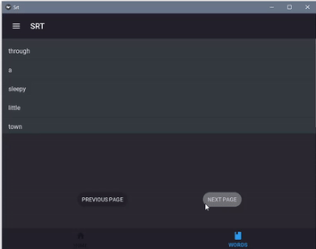

# LEARN NEW LANGUAGE WITH SRT FILES

> This program is both an android and windows application that helps us learn new languages by translating the words in the srt file into Turkish. 

## Installation

Depending on the platform you are using, you can download its file from the Github releases section.

## Usage

To use the program, you first upload the srt file using the upload srt button on the main page.

After uploading, you can now see all the words in the srt file by clicking the words button at the bottom.

You can see the Turkish equivalent by clicking on the word and you can also look at the next word page with the previous and next buttons.

Have a nice try!

If you run into a problem, you can let me know here or on my Twitter account. - [@Mehmetkaragoz07](https://twitter.com/Mehmetkaragoz07) - karagoz.mhmtg@gmail.com

https://github.com/mehmet-karagoz