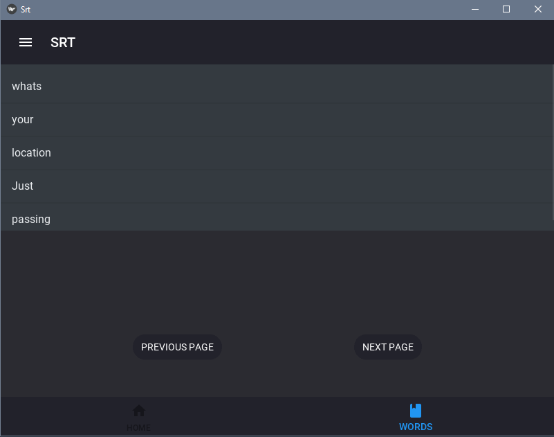

# LEARN NEW LANGUAGE WITH SRT FILES

> This program is both an android and windows application that helps us learn new languages by translating the words in the srt file into Turkish. 

## Installation

Depending on the platform you are using, you can download its file from the [Github releases](https://github.com/mehmet-karagoz/Learn-New-Language-With-Srt-Files/releases) section.

## Usage

To use the program, first you need to register the program so that your progress can be saved. You can then log into the program. When you log in to the program, you need to click the button to load the srt file from the main screen.

After uploading, you can now see all the words in the srt file by clicking the words button at the bottom.

You can see the Turkish equivalent by clicking on the word and you can also look at the next word page with the previous and next buttons. If you think you have learned that word or when you come across a word you know, you can add it to the words you know by swiping the word from right to left. After adding, the word is deleted from the list.

Have a nice try!

If you run into a problem, you can let me know here or on my Twitter account. - [@Mehmetkaragoz07](https://twitter.com/Mehmetkaragoz07) - karagoz.mhmtg@gmail.com

https://github.com/mehmet-karagoz
